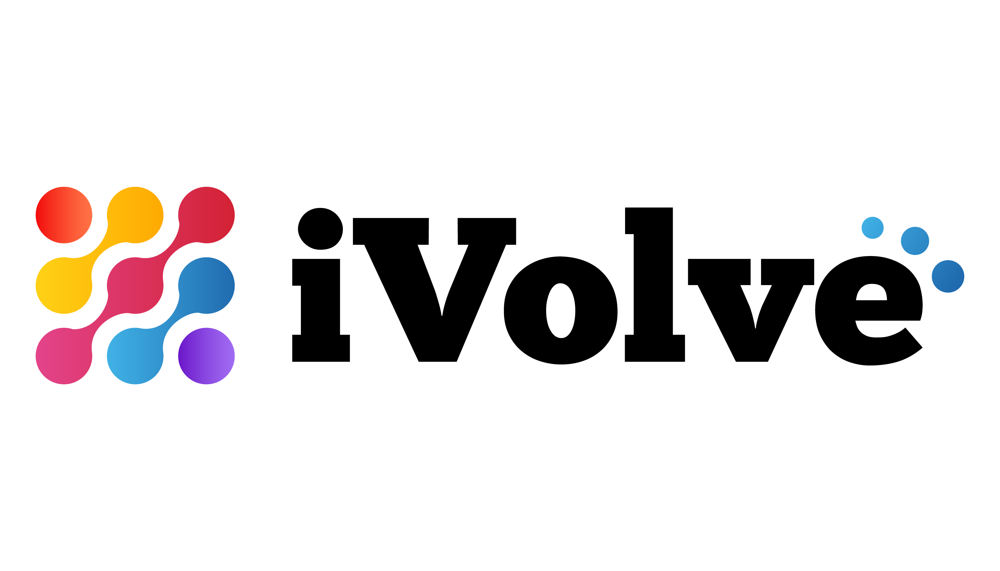
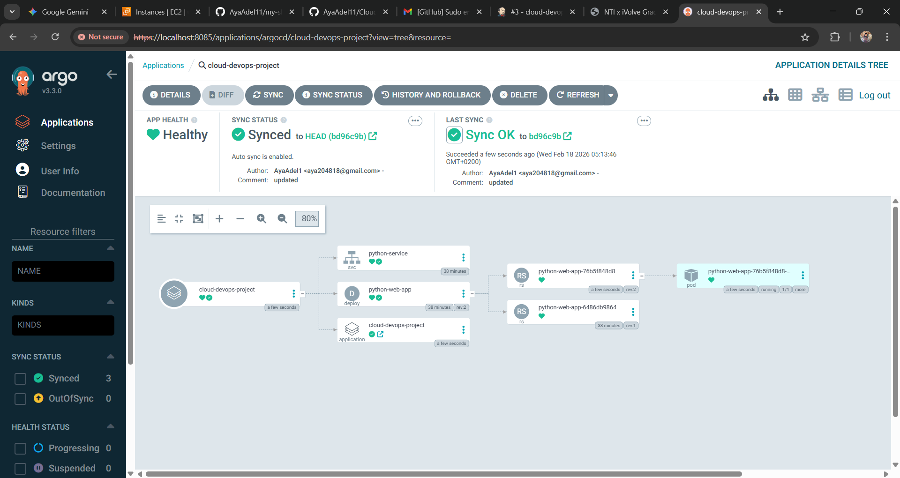
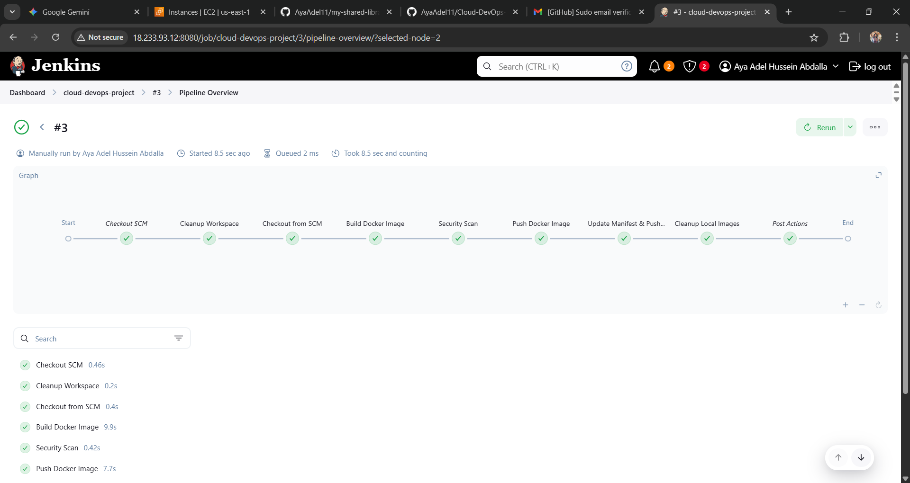
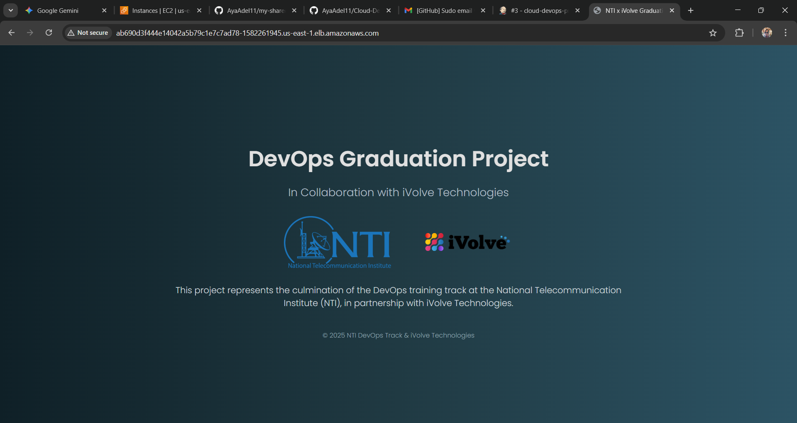
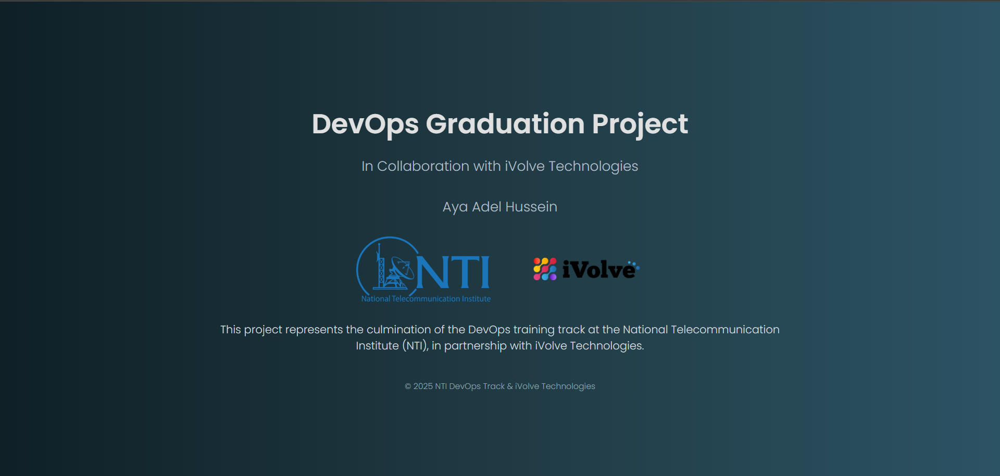

<p align="center">
  
  &nbsp;&nbsp;&nbsp;&nbsp;
  
</p>

<h1 align="center" style="font-family: 'Poppins', sans-serif; color: #e0e0e0; font-size: 2.8rem;">
   DevOps Graduation Project
</h1>

<h3 align="center" style="font-family: 'Poppins', sans-serif; color: #b0bec5;">
  In Collaboration with iVolve Technologies
</h3>

<p align="center" style="max-width: 700px; font-size: 1.1rem; color: #cfd8dc;">
  This project represents the culmination of the DevOps training at the National Telecommunication Institute (NTI),
  in partnership with iVolve Technologies. 
</p>

## 📑 Project Overview

This project demonstrates a full End-to-End CI/CD Pipeline with a GitOps approach. It hosts a Python web application on AWS EKS (Elastic Kubernetes Service), automated via Jenkins, and continuously deployed using ArgoCD.

## 🏗️ Architecture & Tools

Infrastructure: AWS (EKS, EC2, VPC)

Containerization: Docker

CI Tool: Jenkins

CD & GitOps: ArgoCD

Provisioning: Terraform

Configuration: Ansible

## 🛠️ Key Project Phases

### 1. Infrastructure as Code (IaC)
I used Terraform to provision the cloud environment, including the VPC and the EKS cluster. Configuration was handled via Ansible to ensure the servers were ready for the workload.

### 2. Continuous Integration (CI) with Jenkins
Configured a Jenkins Pipeline to automate the build process.

Integrated GitHub Webhooks to trigger builds automatically upon code pushes.

The pipeline builds the Docker image and pushes it to Docker Hub.

Note: Implemented [ci skip] logic to prevent infinite loops during automated commits.

### 3. GitOps Delivery with ArgoCD
Instead of manual kubectl commands, I implemented ArgoCD for Continuous Deployment:

Application Manifest: Created a declarative argocd-app.yaml to define the desired state.

Automated Sync: ArgoCD monitors the GitHub repository and automatically synchronizes changes to the ivolve namespace in the EKS cluster.

Self-Healing: Ensures the cluster state always matches the Git repository.

## 📸 Final Results & Deliverables
### ✅ ArgoCD Deployment Status
The application is fully synchronized and healthy. Below is the resource tree showing the Deployment, Service, and Pods.


### ✅ Jenkins Pipeline Success
Multiple successful builds triggered by webhooks, ensuring the latest code is always containerized.


### ✅ Live Application
The Python web application is accessible via the AWS LoadBalancer.




### Additional Documentation & Screenshots
Note: For a comprehensive view of the project execution, including intermediate steps, configuration logs, and troubleshooting, please refer to the Screenshots Folder.
[Screenshots Folder](./screenshots)

## 📂 Project Structure

```bash 
.
├── Dockerfile          # Container definition
├── Jenkinsfile         # CI pipeline script
├── argocd-app.yaml     # GitOps application definition
├── app.py              # Python application code
├── deployment.yaml     # K8s deployment manifest
├── service.yaml        # K8s service manifest
└── terraform/          # Infrastructure code
```


---

